# DroneController

**A quadcopter flight controller built from scratch on an STM32G4, from raw
IMU registers to motor PWM.**

DroneController is a complete "+"-configuration quadrotor flight-control
firmware: it reads an MPU6050 IMU and an RC receiver, fuses the IMU
readings into roll/pitch attitude estimates, runs a PID control loop
against the stick/throttle commands, and mixes the result into four ESC
PWM outputs — all inside a hard real-time 1 kHz control loop on a
Cortex-M4.


---

## Why this project

Rather than starting from an existing flight-control stack (Betaflight,
ArduPilot, ...), this project builds every layer of the controller from
first principles: the IMU driver, the attitude estimator, the PID loop,
and the motor-mixing law are all hand-written and tuned specifically for
this airframe. The goal was to understand — and be able to defend every
line of — the full path from raw accelerometer/gyro counts to commanded
motor speed, running under a hard 1 ms control-loop budget.

## Key engineering highlights

- **Two attitude estimators, same interface**: a fixed-gain Kalman filter
  (`callKF`) and a complementary filter (`callCompFilter`) both estimate
  roll/pitch from accelerometer + gyro data behind the same `struct est`
  interface, so the active estimator is a one-line swap in
  [`main.c`](Core/Src/main.c).
- **Interrupt-driven RC decoding**: all four RC channels (roll, pitch, yaw,
  throttle) are decoded concurrently from standard hobby-PWM pulses using
  input-capture timers in indirect mode (one channel's rising-edge period,
  the other's pulse width), with a digital low-pass filter smoothing each
  decoded channel before it reaches the controller.
- **Deterministic 1 kHz control loop**: a free-running timer (`TIM6`) is
  polled at the end of every loop iteration to pad execution out to an
  exact 1 ms period — sensor read, attitude estimate, PID update, and
  motor-mixing all have to fit comfortably inside that budget.
- **Startup self-calibration**: the firmware automatically runs a gyro-bias
  calibration (stationary averaging window) and an ESC calibration
  sequence (max-then-min throttle pulse) every boot, before entering the
  control loop.
- **Motor mixing with physical limits**: the "+"-configuration mixing law
  converts roll/pitch/yaw/thrust commands into four motor angular speeds
  via the drone's real arm length and thrust/drag coefficients
  (`PID.h`), square-roots the per-motor thrust demand into a commanded
  speed, and clamps it to the ESC's actual PWM range and the motor's rated
  maximum speed.

## Hardware

| Component | Part                        | Purpose                                   |
|-----------|------------------------------|--------------------------------------------|
| MCU       | STM32G431KBT6 (Cortex-M4)    | Main flight controller, 170 MHz             |
| IMU       | MPU6050                      | 3-axis accelerometer + gyroscope (I2C)     |
| RC input  | 4× PWM, input-capture timers | Roll / pitch / yaw / throttle from receiver |
| Actuators | 4× ESC, PWM output           | "+"-configuration quadrotor motor speed control |

The schematic and PCB below are from the custom sensor/IO carrier board
for this airframe (IMU, ultrasonic rangefinder, ESP32 wireless link, and
the PWM breakout to the flight-controller MCU); the firmware in this
repo currently drives the core IMU + RC + ESC path described above.

<p>
  
  
</p>

## Firmware architecture

```
Core/
├── Inc/                  Public headers for every module
├── Src/
│   ├── main.c             Peripheral init, RC decode ISR, 1 kHz control loop, calibration
│   ├── IMU_KF.c            Roll/pitch Kalman filter + complementary filter (shared `struct est`)
│   ├── PID.c               Roll/pitch/yaw/altitude PID loops + "+"-config motor mixing
│   ├── mpu6050.c           MPU6050 IMU driver (I2C register read/write, raw-to-SI conversion)
│   └── stm32g4xx_*.c       STM32CubeMX-generated HAL glue (clocks, IRQ vectors, syscalls)
└── Startup/               STM32CubeMX-generated startup assembly
```

### Control pipeline

```
RC receiver (4ch PWM) ──► Input-capture timers ──► low-pass filter ──► roll/pitch/yaw/thrust refs
                                                                               │
MPU6050 (accel + gyro) ──► callCompFilter / callKF ──► roll, pitch estimate ──┼──► PID (callPID) ──► motor mixing ──► 4× ESC PWM
                                                                               │        (roll/pitch/yaw/altitude loops)
                                                              1 kHz loop, timed by TIM6
```

The two attitude estimators in [`IMU_KF.c`](Core/Src/IMU_KF.c) are kept
side by side intentionally: `callCompFilter` is what `main.c` currently
calls, while `callKF` implements a fixed-gain roll/pitch Kalman filter
behind the identical interface for direct comparison.

## MATLAB controller simulation

The standalone [simulation](simulation/README.md) lives entirely in
`simulation/`, separate from the embedded firmware. It compares
**discrete LQR and constrained linear MPC** on the same nonlinear,
12-state quadrotor plant, with an ideal baseline and a separate
wind-and-motor-lag experiment. These are simulation results, not
hardware flight-test results.

From the repository root in MATLAB (Control System Toolbox and Model
Predictive Control Toolbox required):

```matlab
run(fullfile('simulation', 'matlab', 'run_controller_comparison.m'))
```

The default circle has a 2 m radius, a 30 s period, a 2.5 m altitude,
and a 5 s smooth ramp. Both controllers run at **20 Hz** for 45 s, with
the same physical state/input cost weights and rotor/rate limits.
MPC predicts 2 s ahead using the known trajectory; LQR receives the
current reference, including velocity and attitude feedforward.
Neither controller knows the injected wind or models the added motor lag.

Verified in MATLAB R2024b; RMS here means the **Euclidean 3D position
error**, not the smaller coordinate-averaged metric from the old plots:

| Experiment | LQR 3D RMS | MPC 3D RMS | LQR peak | MPC peak |
|------------|------------|------------|----------|----------|
| Ideal baseline | 1.78 cm | 0.27 cm | 7.52 cm | 1.29 cm |
| Wind + 40 ms motor lag | 4.62 cm | 4.26 cm | 12.67 cm | 12.68 cm |

The excellent ideal tracking is conditional on perfect state feedback,
a slow trajectory, and accurate model parameters. MPC's future reference
preview improves the startup transient; its wind rejection is not
automatically better. In the disturbed case the peak errors are almost
identical. The nonlinear plant's previously inconsistent yaw mapping has
also been corrected and tested, so the old two-LQR figures are superseded.

### Ideal baseline: full comparison

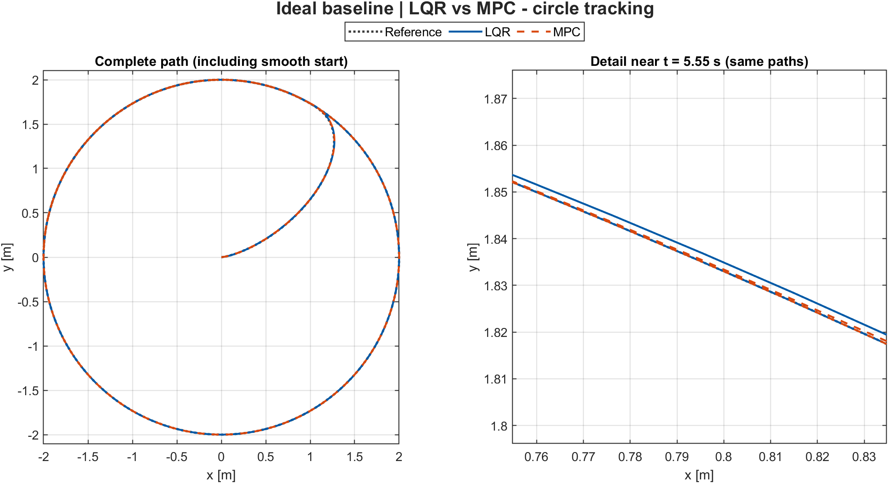

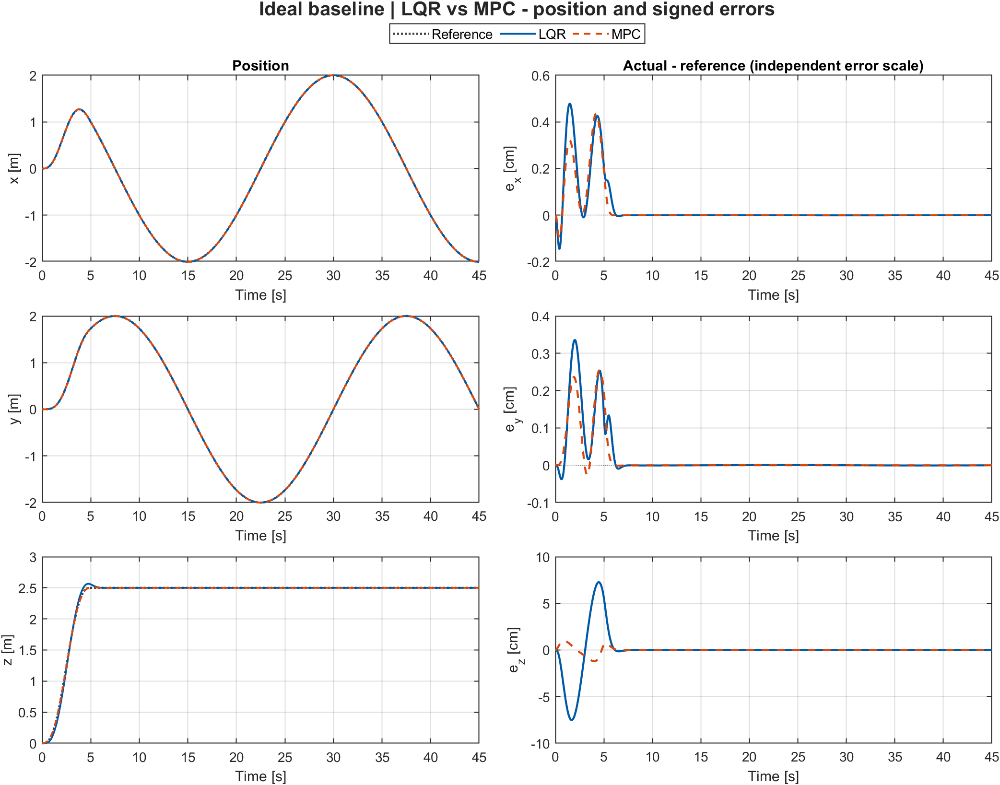

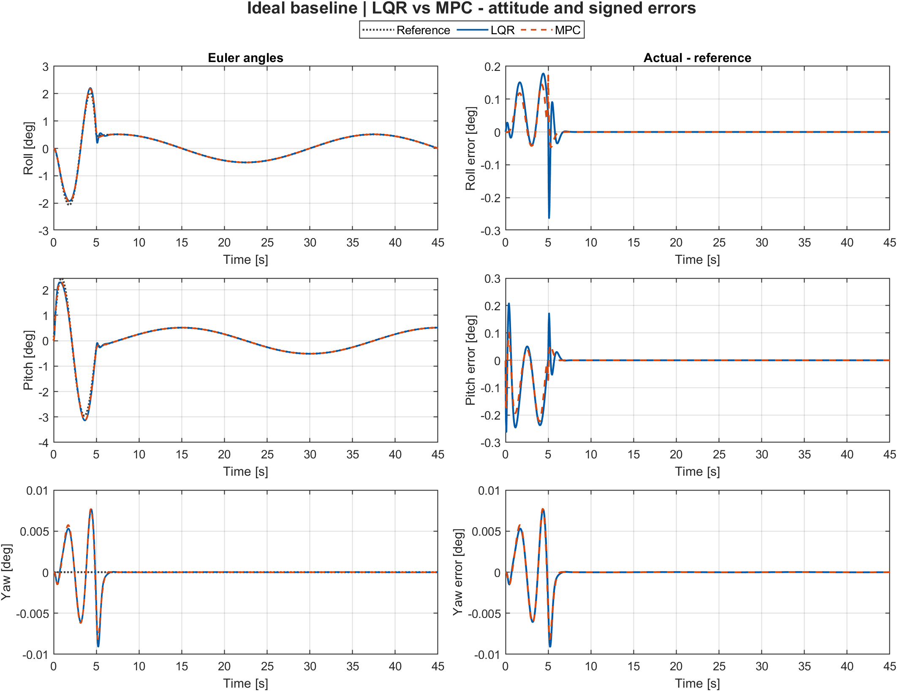

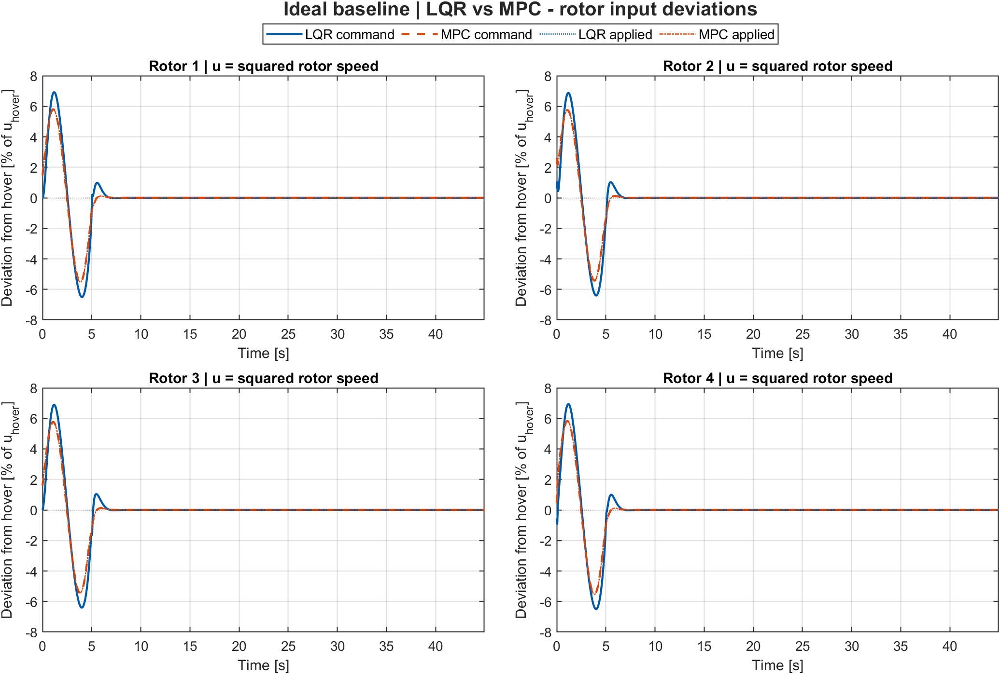

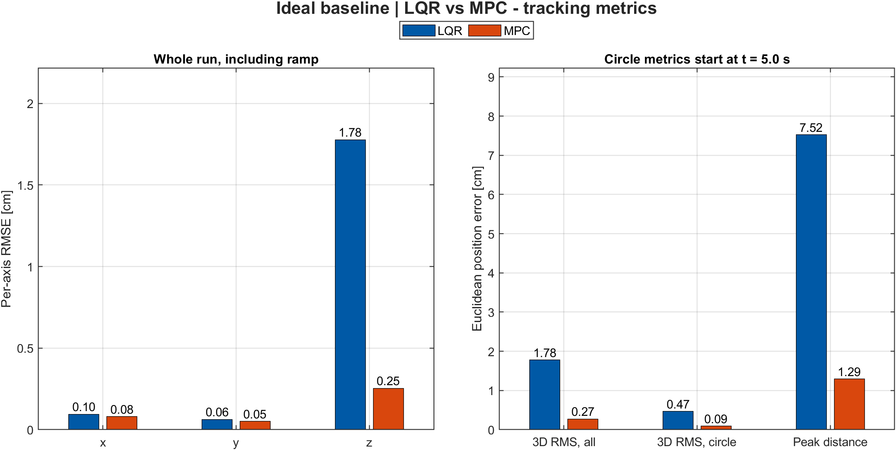

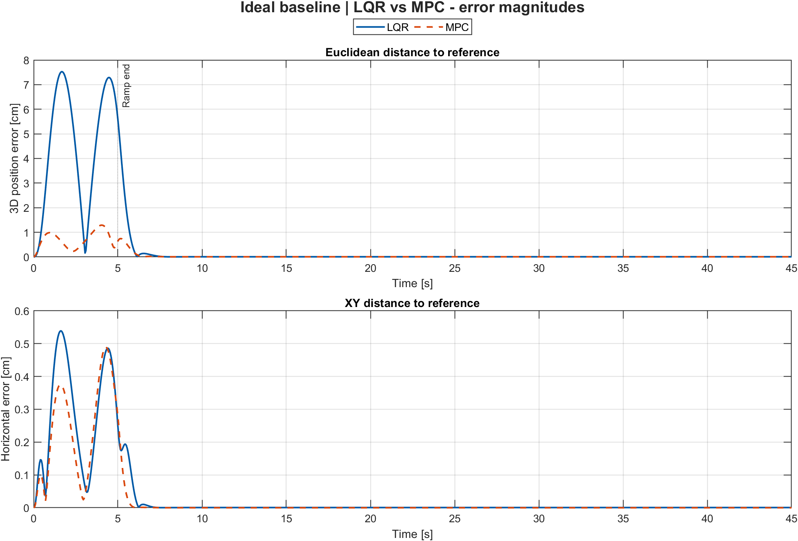

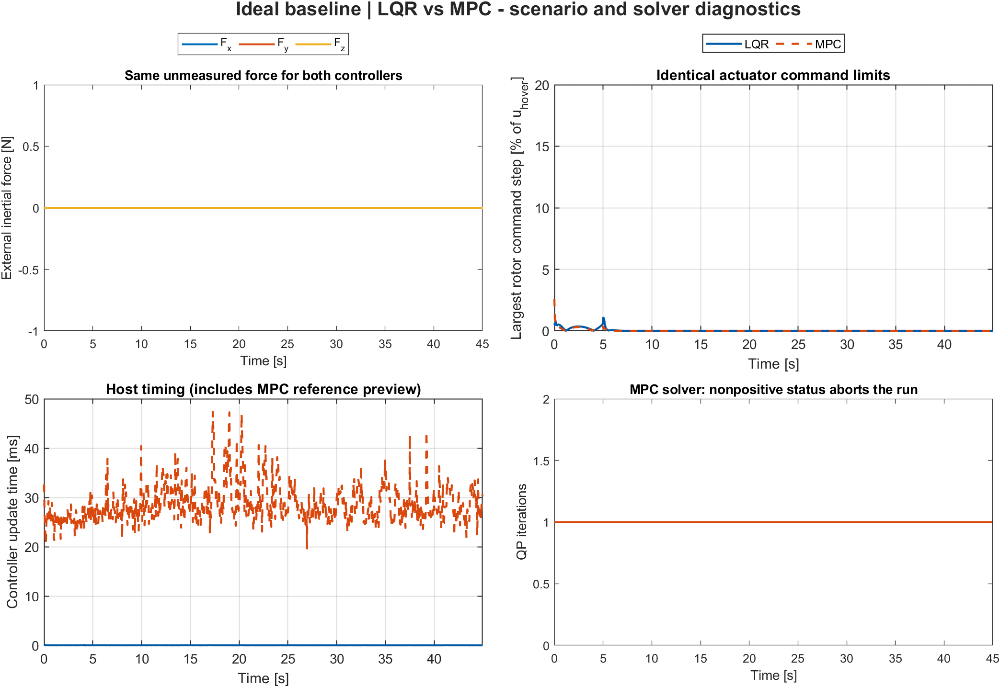

### Wind and motor lag: full comparison

The repeatable force acts between 12 and 28 s. This is a simplified
robustness test, not a calibrated aerodynamic wind model.


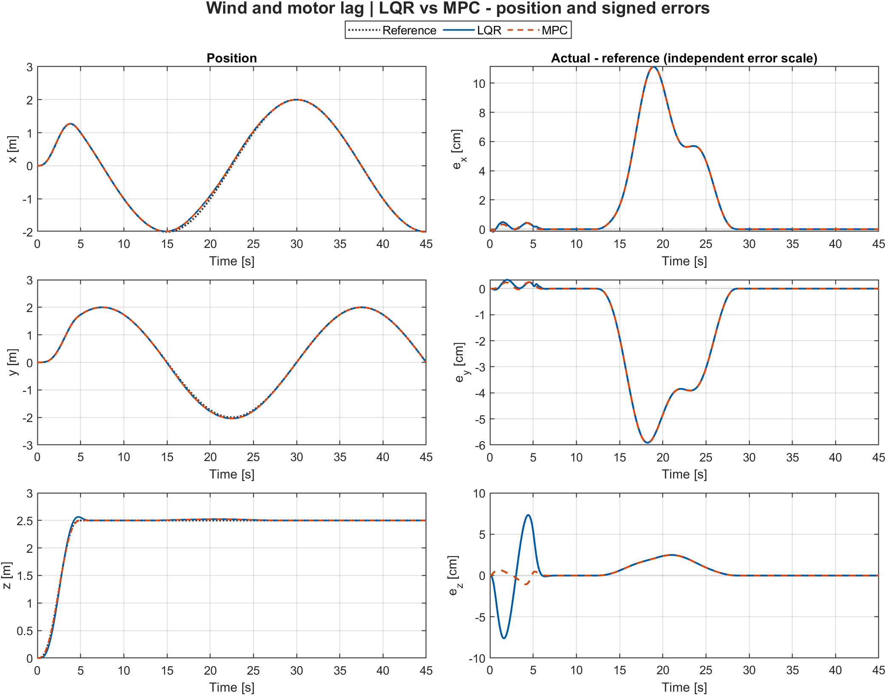

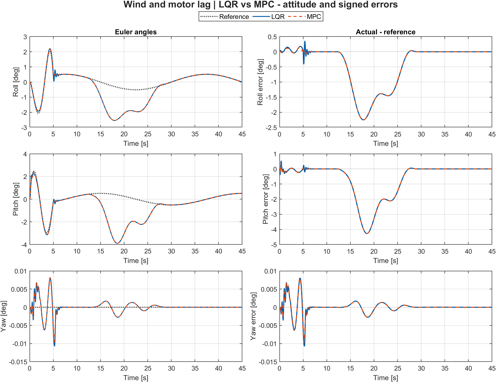

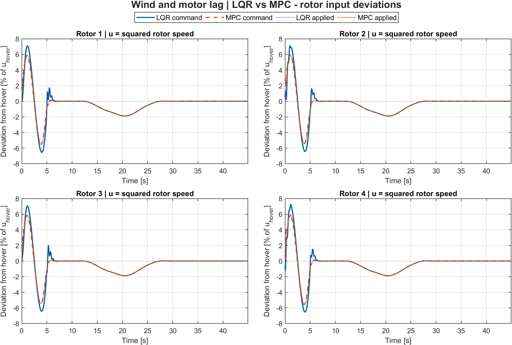


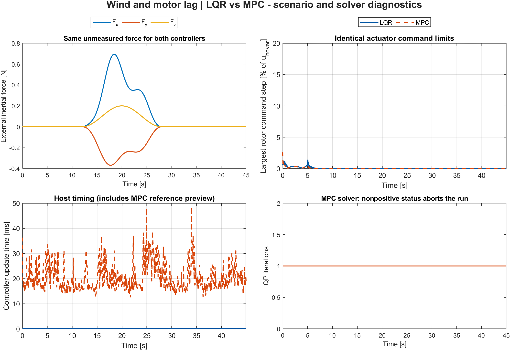

All figures use consistent colours and line styles, external legends,
zoomed/error panels, and high-resolution exports. Exact metrics are in
[metrics.csv](simulation/results/metrics.csv). See the
[simulation guide](simulation/README.md) for equations, MPC formulation,
test commands, and limitations. The separate nonlinear MPC template
remains experimental; **linear MPC is implemented and tested**.

## Testing

`IMU_KF.c` (attitude estimation) and `PID.c` (control + motor mixing) have
zero HAL/MCU dependencies, so they're covered by a native unit test suite
that builds and runs on the host with plain `gcc` (no ARM toolchain or
hardware required). The tests link the real firmware source directly;
there are no mocks of the filter or control logic.

```sh
make -C tests test
```

Coverage includes rest-state and static-tilt convergence checks for both
attitude estimators, and motor-mixing invariants for the PID loop (equal
motor speeds under pure hover thrust, correct differential thrust under a
roll command, and saturation at both the zero floor and `w_max`). This
suite runs automatically on every push via
[GitHub Actions](.github/workflows/tests.yml).

## Building

This is an STM32CubeIDE project (also buildable with plain
`arm-none-eabi-gcc` and the provided linker script,
`STM32G431KBTX_FLASH.ld`).

1. Open the project in [STM32CubeIDE](https://www.st.com/en/development-tools/stm32cubeide.html).
2. Build the `Debug` or `Release` configuration.
3. Flash via ST-Link/SWD (`DroneController Debug.launch` is provided for
   debugging directly from CubeIDE).

The `.ioc` file (`DroneController.ioc`) can be reopened in STM32CubeMX to
regenerate peripheral initialization code; all application logic lives
outside the generated `USER CODE` boundaries and is untouched by
regeneration.

## Status

This is an active personal R&D project rather than a flight-proven,
production flight stack: the Kalman filter and complementary filter are
both implemented and unit-tested, but only the complementary filter has
been flown. Treat the gyro-offset constants and PID gains in
[`PID.h`](Core/Inc/PID.h) as airframe-specific starting points, not
general-purpose defaults.


## Author

Designed, built, and written by **Luca Obwegs**.

## License

This project is licensed under the GNU General Public License v3.0 — see
[LICENSE](LICENSE) for details.
