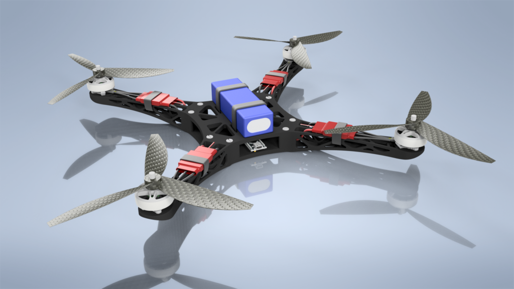
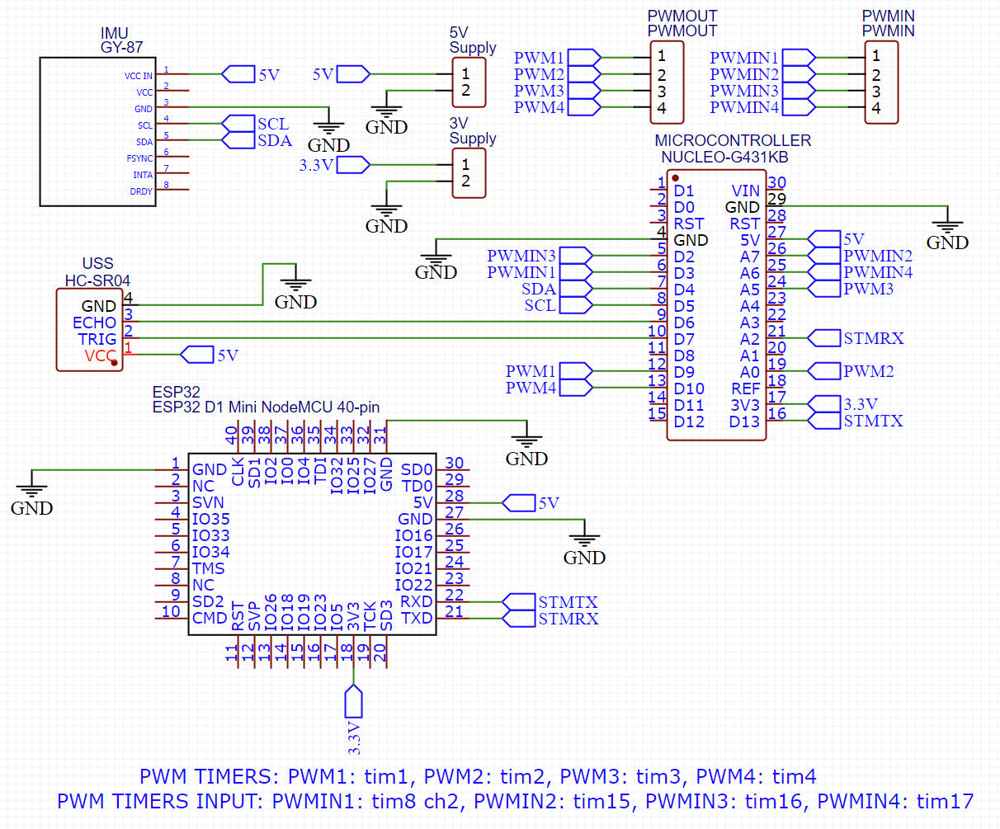
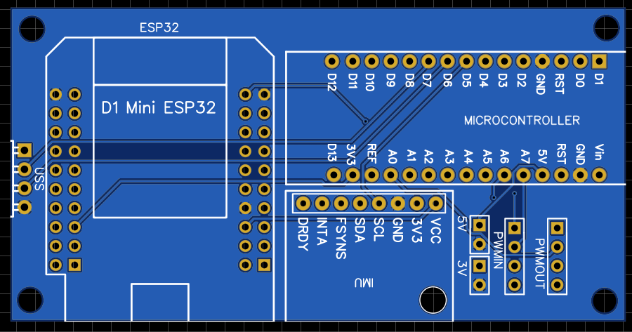
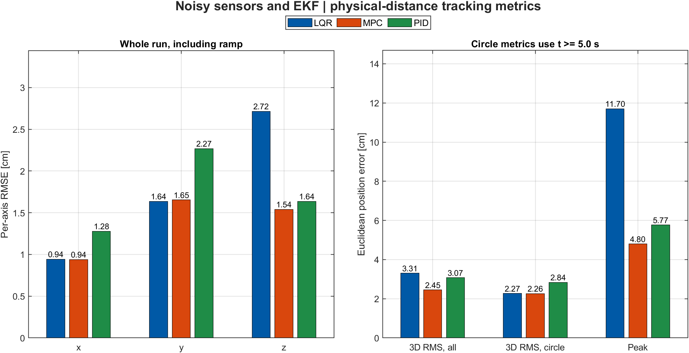
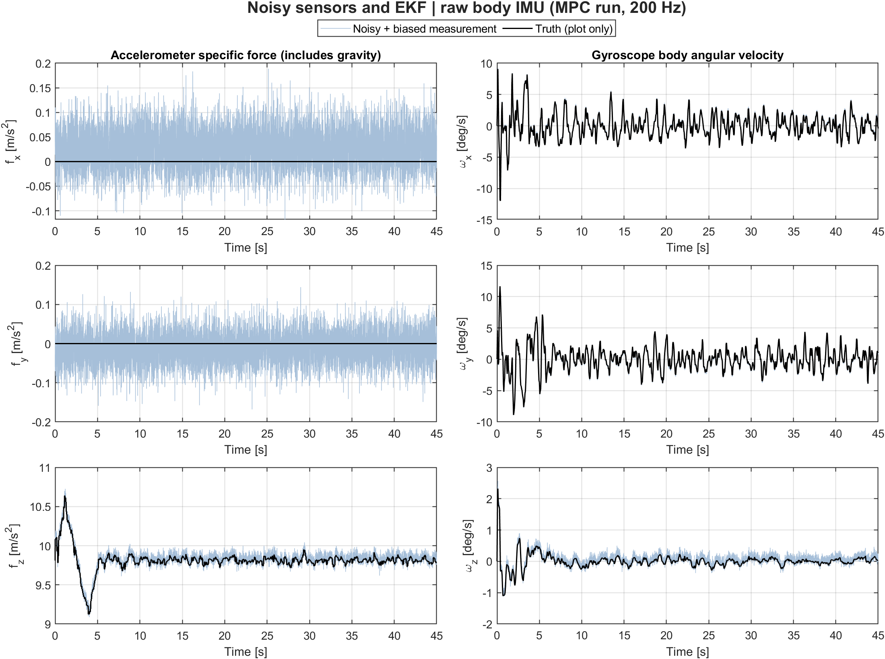
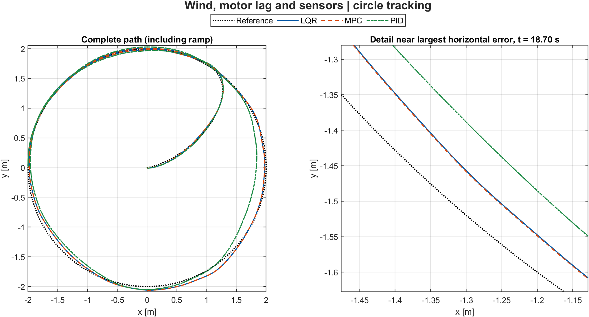
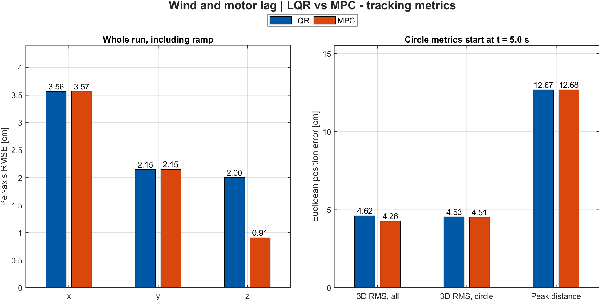
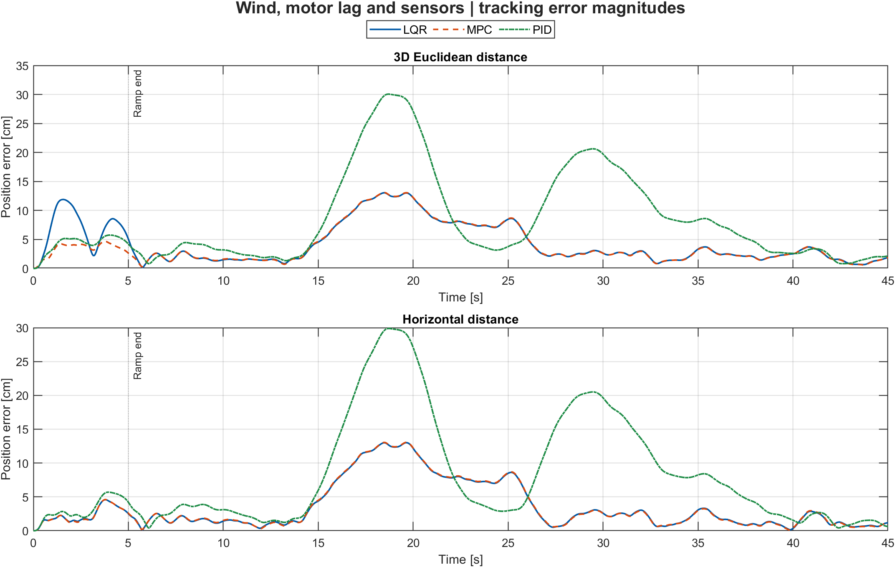
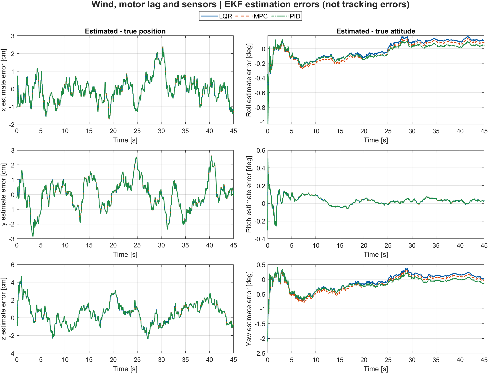
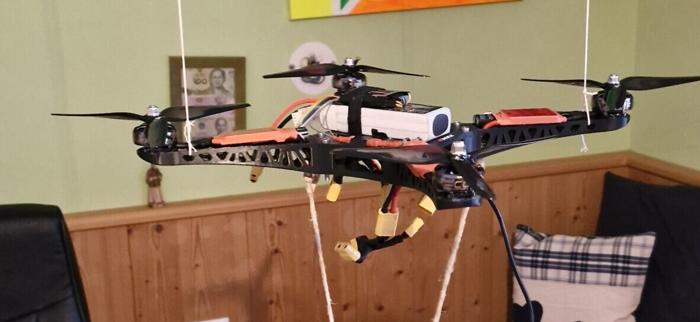

# DroneController

**A quadcopter flight controller built from scratch on an STM32G4, from raw
IMU registers to motor PWM.**

DroneController is a complete "+"-configuration quadrotor flight-control
firmware: it reads an MPU6050 IMU and an RC receiver, fuses the IMU
readings into roll/pitch attitude estimates, runs a PID control loop
against the stick/throttle commands, and mixes the result into four ESC
PWM outputs — all inside a hard real-time 1 kHz control loop on a
Cortex-M4.

The **IMU** measures acceleration-related force and turning rate.
**PWM** is a pulse signal sent to each **ESC** (electronic speed controller)
to command a motor. Roll and pitch mean sideways and forward/backward
tilt; yaw means turning the heading.




---

## Why this project

Rather than starting from an existing flight-control stack (Betaflight,
ArduPilot, ...), this project builds every layer of the controller from
first principles: the IMU driver, the attitude estimator, the PID loop,
and the motor-mixing law are all hand-written and tuned specifically for
this airframe. The goal was to understand — and be able to defend every
line of — the full path from raw accelerometer/gyro counts to commanded
motor speed, running under a hard 1 ms control-loop budget.

## Key engineering highlights

- **Two attitude estimators, same interface**: a fixed-gain Kalman filter
  (`callKF`) and a complementary filter (`callCompFilter`) both estimate
  roll/pitch from accelerometer + gyro data behind the same `struct est`
  interface, so the active estimator is a one-line swap in
  [`main.c`](Core/Src/main.c).
- **Interrupt-driven RC decoding**: all four RC channels (roll, pitch, yaw,
  throttle) are decoded concurrently from standard hobby-PWM pulses using
  input-capture timers in indirect mode (one channel's rising-edge period,
  the other's pulse width), with a digital low-pass filter smoothing each
  decoded channel before it reaches the controller.
- **Deterministic 1 kHz control loop**: a free-running timer (`TIM6`) is
  polled at the end of every loop iteration to pad execution out to an
  exact 1 ms period — sensor read, attitude estimate, PID update, and
  motor-mixing all have to fit comfortably inside that budget.
- **Startup self-calibration**: the firmware automatically runs a gyro-bias
  calibration (stationary averaging window) and an ESC calibration
  sequence (max-then-min throttle pulse) every boot, before entering the
  control loop.
- **Motor mixing with physical limits**: the "+"-configuration mixing law
  converts roll/pitch/yaw/thrust commands into four motor angular speeds
  via the drone's real arm length and thrust/drag coefficients
  (`PID.h`), square-roots the per-motor thrust demand into a commanded
  speed, and clamps it to the ESC's actual PWM range and the motor's rated
  maximum speed.

## Hardware

| Component | Part                        | Purpose                                   |
|-----------|------------------------------|--------------------------------------------|
| MCU       | STM32G431KBT6 (Cortex-M4)    | Main flight controller, 170 MHz             |
| IMU       | MPU6050                      | 3-axis accelerometer + gyroscope (I2C)     |
| RC input  | 4× PWM, input-capture timers | Roll / pitch / yaw / throttle from receiver |
| Actuators | 4× ESC, PWM output           | "+"-configuration quadrotor motor speed control |

The schematic and PCB below are from the custom sensor/IO carrier board
for this airframe (IMU, ultrasonic rangefinder, ESP32 wireless link, and
the PWM breakout to the flight-controller MCU); the firmware in this
repo currently drives the core IMU + RC + ESC path described above.

<p>
  
  
</p>

## Firmware architecture

```
Core/
├── Inc/                  Public headers for every module
├── Src/
│   ├── main.c             Peripheral init, RC decode ISR, 1 kHz control loop, calibration
│   ├── IMU_KF.c            Roll/pitch Kalman filter + complementary filter (shared `struct est`)
│   ├── PID.c               Roll/pitch/yaw/altitude PID loops + "+"-config motor mixing
│   ├── mpu6050.c           MPU6050 IMU driver (I2C register read/write, raw-to-SI conversion)
│   └── stm32g4xx_*.c       STM32CubeMX-generated HAL glue (clocks, IRQ vectors, syscalls)
└── Startup/               STM32CubeMX-generated startup assembly
```

### Control pipeline

```
RC receiver (4ch PWM) ──► Input-capture timers ──► low-pass filter ──► roll/pitch/yaw/thrust refs
                                                                               │
MPU6050 (accel + gyro) ──► callCompFilter / callKF ──► roll, pitch estimate ──┼──► PID (callPID) ──► motor mixing ──► 4× ESC PWM
                                                                               │        (roll/pitch/yaw/altitude loops)
                                                              1 kHz loop, timed by TIM6
```

The two attitude estimators in [`IMU_KF.c`](Core/Src/IMU_KF.c) are kept
side by side intentionally: `callCompFilter` is what `main.c` currently
calls, while `callKF` implements a fixed-gain roll/pitch Kalman filter
behind the identical interface for direct comparison.

## MATLAB controller simulation

The standalone [simulation](simulation/README.md) lives entirely in
`simulation/`, separate from the embedded firmware. It compares
**LQR, constrained linear MPC, and cascaded PID with standard motor
mixing** on the same nonlinear quadrotor plant. Noisy-sensor experiments
use an **extended Kalman filter (EKF)** to estimate motion from noisy
sensors instead of giving the controllers the exact simulated state.
These are simulation results, not hardware flight-test results.

From the repository root in MATLAB (Control System Toolbox and Model
Predictive Control Toolbox required):

```matlab
run(fullfile('simulation', 'matlab', 'run_controller_comparison.m'))
```

The default circle has a 2 m radius, a 30 s period, a 2.5 m altitude,
and a 5 s smooth ramp. All controllers run at **20 Hz** for 45 s with
shared limits on motor commands and how quickly they may change.
A **200 Hz noisy accelerometer/gyro**, **10 Hz RTK-GNSS** (satellite
position and velocity with correction data), and **20 Hz magnetometer**
(magnetic-field sensor) supply the EKF. Small sensor offsets and gradual
drift are included. Centimetre positioning assumes a working RTK fix;
it is not the accuracy of ordinary GPS.

MPC plans 2 s ahead. LQR corrects the current error in position, tilt,
velocity, and turning rate. PID first decides how to move, then adjusts
tilt and thrust to do it. Its accumulated error is held when motor limits
are reached, preventing excessive buildup ("anti-windup"). All three
produce commands for the same four motors. LQR/MPC use the same error
and motor-effort priorities; PID is separately tuned.

Verified in MATLAB R2024b. **3D RMS error** summarizes the drone's distance
from the target over the run, giving larger misses more weight. Smaller
is better; it is not the worst-case error.

| Experiment | LQR 3D RMS | MPC 3D RMS | PID 3D RMS |
|------------|------------|------------|------------|
| Perfect-state ideal | 1.78 cm | 0.27 cm | 0.39 cm |
| Noisy sensors + EKF | 3.31 cm | 2.45 cm | 3.07 cm |
| Sensors + wind + 40 ms motor lag | 5.63 cm | 5.17 cm | 11.39 cm |

### What the results actually show

- **Ideal accuracy is conditional.** Perfect feedback, shared plant/model
  parameters, slow motion, and use of the planned path explain the small errors.
  These are not measured flight accuracies.
- **MPC is not uniformly better at wind rejection.** In the disturbed run,
  LQR/MPC horizontal axis RMSEs are almost identical (x: 3.95/3.95 cm;
  y: 2.98/3.03 cm). Their circle-only 3D RMS is 5.32/5.34 cm.
  MPC's whole-run benefit is principally startup/vertical tracking
  (z RMSE: 2.68 cm LQR versus 1.42 cm MPC), consistent with its preview.
  Circle-only means `t >= 5 s`, not a separately settled steady-state run.
- **PID depends on the chosen gains.** Its disturbed peak is 30.06 cm,
  versus 13.04/13.08 cm for LQR/MPC. The audit also shows larger errors
  during wind and slower post-wind recovery with this tuning. This is
  consistent with the response speed and accumulated-error recovery of
  the current tuning,
  not evidence that PID is inherently inferior.
- **No actuator limits activate in these default runs.** The differences
  are not caused by motor saturation or windup, and the plots do not
  demonstrate MPC's constraint advantage. Active constraints and PID
  anti-windup are exercised separately by regression tests.
- **Sensing sets a centimetre-scale floor under the assumptions.**
  Position-estimation RMS is about 1.79 cm for all three controllers.
  RTK fixed-solution accuracy and calibrated MEMS noise are assumed, not
  measured specifications of the physical drone.

The table and six figures use seed `20261002`. A separate **three-seed,
18-run check with different sensor-noise sequences** recomputes RMS
independently and checks for invalid numbers, broken motor limits,
invalid final filter uncertainty, and failed MPC calculations. Maximum
roll/pitch stayed below 4.71 degrees, so a controller model designed for
small tilts is reasonable here. Ranges across seeds `20261002`-`20261004`:

| Disturbed case | Whole-run 3D RMS | Wind window, 12-28 s | Recovery, 32-45 s |
|----------------|------------------|---------------------|------------------|
| LQR | 4.61-5.63 cm | 6.73-7.96 cm | 1.90-2.22 cm |
| MPC | 4.28-5.17 cm | 6.73-8.01 cm | 1.90-2.20 cm |
| PID | 9.80-11.39 cm | 13.85-15.49 cm | 5.50-6.00 cm |

Three noise sequences are a useful repeatability check, not enough to
establish statistical reliability. Exact results are in [metrics.csv](simulation/results/metrics.csv)
and [validation.csv](simulation/results/validation.csv). Wind is a
repeatable injected force, not calibrated aerodynamics. Sensor latency,
vibration, magnetic interference, RTK loss, drag, and ground contact are
not modeled. Host controller timings exclude EKF/plant integration and
do not establish an embedded real-time deadline.

### Six key comparison figures

The default run retains only these six high-resolution plots. The ideal
baseline remains in the numerical table; optional full diagnostics can
be generated locally using the [simulation guide](simulation/README.md).

**Noisy sensors: per-axis and 3D tracking errors**



**The simulated IMU: body-frame specific force and angular velocity**



**Wind and motor lag: circle tracking with a zoomed error detail**



**Wind and motor lag: error summary and evolution**





**Estimator errors, distinct from trajectory-tracking errors**



### Simulation equations and state-space models

You do not need to work through a matrix derivation to read the plots.
The equations below explain the main ideas; the
[technical guide](simulation/MODEL_AND_CONTROL.md) keeps the full
matrices, controller gains, and filter uncertainty equations.
These models describe the MATLAB simulation, not the firmware filters.

**Reading the notation:** a dot means "change per second"; a hat means
"estimated from sensors"; `ref` means the desired path; and $k$ is the
current control step. A **state** is just a list describing the drone:
position, tilt/heading, velocity, and angle rates. Positions use metres,
angles use radians in the code, and plot labels show their units.

#### Drone motion: thrust, gravity, and turning

The motors push along the drone's vertical axis. Tilting the drone turns
some of that thrust into sideways acceleration. Gravity pulls downward,
and the wind test adds an external force:

$$
\dot r=v,\qquad
m\dot v=T R_b^n e_3-mg e_3+F_w,\qquad
I\dot\Omega=\tau-\Omega\times(I\Omega).
$$

Here $r$ is position, $v$ velocity, $m$ mass, $g$ gravity, $T$ total
thrust, and $F_w$ the injected wind force. $e_3$ points upward;
$R_b^n$ rotates the thrust direction from drone axes into world axes.
The last equation describes turning: $\tau$ is motor torque, $\Omega$
the rotation rate measured in drone axes, and $I$ describes resistance
to turning. The simulator converts these body rates into roll, pitch,
and yaw rates; they are not interchangeable when tilted.

**Motor mixing** distributes the requested thrust and turning effort
among four motors in a plus-shaped frame:

$$
\begin{bmatrix}T\\\tau_x\\\tau_y\\\tau_z\end{bmatrix}
=\underbrace{\begin{bmatrix}
k_t&k_t&k_t&k_t\\lk_t&0&-lk_t&0\\
0&lk_t&0&-lk_t\\d&-d&d&-d
\end{bmatrix}}_{M}
\begin{bmatrix}u_1\\u_2\\u_3\\u_4\end{bmatrix},
\qquad u_i=\omega_i^2.
$$

Each row says which motors add or subtract effort: all add lift,
opposite motors control roll/pitch, and alternating spin directions
control yaw. $l$ is arm length; $k_t$ and $d$ convert squared motor
speed into thrust and yaw torque. Commands are **squared angular
speeds**, not PWM. Motor commands and their step-to-step changes are
limited for all controllers. The wind test adds a 40 ms motor response
lag instead of assuming an immediate response.

#### A small-tilt model for LQR and MPC

The simulation uses the full motion equations, but these two controllers
use a simpler model valid near hover:

$$
x_{k+1}=A_dx_k+B_d(u_k-u_{\rm hover}).
$$

$x$ is the 12-value state described above. $A_d$ predicts how that state
changes without changing motor effort; $B_d$ predicts the effect of
changing effort from hover. $u_{\rm hover}$ contains four equal motor
commands that balance gravity. The model advances by 0.05 s per step
(20 Hz). Its exact matrices are in the technical guide.

#### LQR: correct the current error

**Linear Quadratic Regulator (LQR)** uses a precomputed gain matrix $K$
to turn the estimated state error into a motor correction:

$$
u_k=u_{\rm hover}-K(\hat x_k-x_{{\rm ref},k}).
$$

The gain balances tracking errors against motor effort using weights
called $Q$ and $R_u$. Position errors receive more emphasis than angle-rate
errors in this setup. LQR itself stores no accumulated error; the sensor
filter supplies its estimate. The reference includes desired velocity
and tilt as well as position, but the motor baseline is hover.

#### MPC: plan ahead, then apply one move

**Model Predictive Control (MPC)** tries motor-command sequences against
the small-tilt model and chooses the one with the lowest score:

$$
J=\sum_{j=1}^{40}
\left(e_j^TQe_j+\delta u_{j-1}^TR_u\delta u_{j-1}\right).
$$

$e_j$ is the predicted state error at a future step, and $\delta u$ is
motor effort above or below hover. The first term penalizes missed
targets; the second penalizes motor effort. LQR and MPC use the same
weights. MPC looks 40 steps (2 s) ahead, optimizes 20 moves, and holds
the last move for the rest of the prediction. It applies only the first
move, then plans again with the next estimate.

Motor bounds and command-change limits are enforced inside this plan.
The implementation uses normalized commands for numerical scaling,
which does not change the physical score shown above. A failed
optimization stops the run rather than silently returning a substitute.

#### PID: position first, tilt second

**Proportional-Integral-Derivative (PID)** combines three corrections:
current error (P), accumulated error (I), and velocity/rate error (D).
The position loop requests acceleration:

$$
a_c=a_{\rm ref}+K_p^r(r_{\rm ref}-\hat r)
+K_d^r(v_{\rm ref}-\hat v)+K_i^r z_r.
$$

$a_{\rm ref}$ is the planned path acceleration. $z_r$ is the bounded,
updated accumulation of position error, helping remove persistent offsets.
The requested
acceleration sets a desired tilt; a second PID loop corrects tilt and
turning rate:

$$
\alpha_c=K_p^\eta e_\eta+K_d^\eta(\dot\eta_c-\widehat{\dot\eta})
+K_i^\eta z_\eta,\qquad
u_{\rm requested}=M^{-1}\begin{bmatrix}T_c\\I\alpha_c\end{bmatrix}.
$$

$\eta$ means roll, pitch, and yaw; $e_\eta$ is their target-minus-estimate
error; $z_\eta$ is its bounded, updated accumulation. $T_c$ adjusts lift for the
requested vertical acceleration and current tilt. The mixer converts
lift and turning requests into motor commands.

The controller remembers both accumulated errors and the previous tilt
target. Integrals, acceleration, and tilt targets are bounded. If a motor
amplitude or command-change limit is hit, both integrals stop accumulating
for that step. This is a small-tilt cascade, not exact nonlinear control.

#### Sensors and Kalman filter: predict, then correct

The IMU measures motion in drone axes. Its accelerometer reads
**specific force**: a stationary level drone reads gravity, while ideal
free fall reads zero. Its gyro measures body turning rate. Both
measurements include a small offset ("bias") and random noise:

$$
f_m=(R_b^n)^T(\dot v+ge_3)+b_a+n_a,\qquad
\Omega_m=\Omega+b_g+n_g.
$$

$b_a,b_g$ are biases and $n_a,n_g$ are noise. Satellite measurements
provide position/velocity; the magnetometer measures the local magnetic
field. These help prevent the drift that would occur with an IMU alone.

The **extended Kalman filter (EKF)** repeats two steps:

1. **Predict at 200 Hz:** subtract estimated biases, rotate acceleration
   into world axes, subtract gravity, then advance position, velocity,
   and orientation.
2. **Correct when aiding arrives:** compare satellite/magnetic readings
   with their predictions and use the difference to adjust the estimate.

The correction has the form

$$
\hat\zeta^+=\hat\zeta^-+L\left(z-h(\hat\zeta^-)\right).
$$

$\zeta$ lists position, velocity, orientation, and the two sensor biases
(15 values). The minus/plus signs mean before/after correction. $z$ is
a sensor reading, $h$ predicts that reading, and $L$ balances trust in
the prediction against trust in the measurement using their estimated
uncertainties.

The controllers receive this estimate, never the exact state in sensed
runs. The filter starts from noisy sensor readings. Its uncertainty
calculation includes approximations; passing the numerical checks does
not prove that its confidence estimates are perfect.

## Testing

`IMU_KF.c` (attitude estimation) and `PID.c` (control + motor mixing) have
zero HAL/MCU dependencies, so they're covered by a native unit test suite
that builds and runs on the host with plain `gcc` (no ARM toolchain or
hardware required). The tests link the real firmware source directly;
there are no mocks of the filter or control logic.

```sh
make -C tests test
```

Coverage includes rest-state and static-tilt convergence checks for both
attitude estimators, and motor-mixing invariants for the PID loop (equal
motor speeds under pure hover thrust, correct differential thrust under a
roll command, and saturation at both the zero floor and `w_max`). This
suite runs automatically on every push via
[GitHub Actions](.github/workflows/tests.yml).

## Building

This is an STM32CubeIDE project (also buildable with plain
`arm-none-eabi-gcc` and the provided linker script,
`STM32G431KBTX_FLASH.ld`).

1. Open the project in [STM32CubeIDE](https://www.st.com/en/development-tools/stm32cubeide.html).
2. Build the `Debug` or `Release` configuration.
3. Flash via ST-Link/SWD (`DroneController Debug.launch` is provided for
   debugging directly from CubeIDE).

The `.ioc` file (`DroneController.ioc`) can be reopened in STM32CubeMX to
regenerate peripheral initialization code; all application logic lives
outside the generated `USER CODE` boundaries and is untouched by
regeneration.

## Status

This is an active personal R&D project rather than a flight-proven,
production flight stack: the Kalman filter and complementary filter are
both implemented and unit-tested, but only the complementary filter has
been flown. Treat the gyro-offset constants and PID gains in
[`PID.h`](Core/Inc/PID.h) as airframe-specific starting points, not
general-purpose defaults.



## Author

Designed, built, and written by **Luca Obwegs**.

## License

This project is licensed under the GNU General Public License v3.0 — see
[LICENSE](LICENSE) for details.
