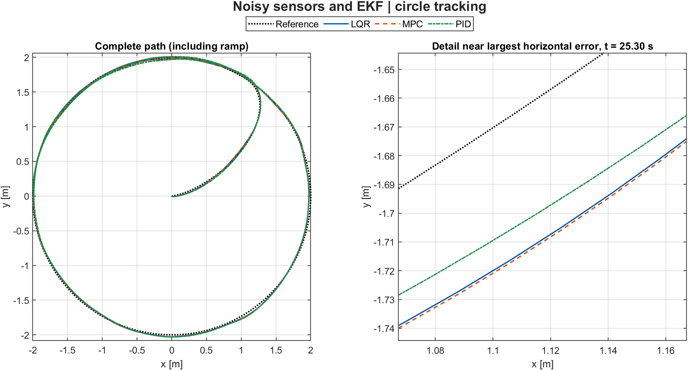
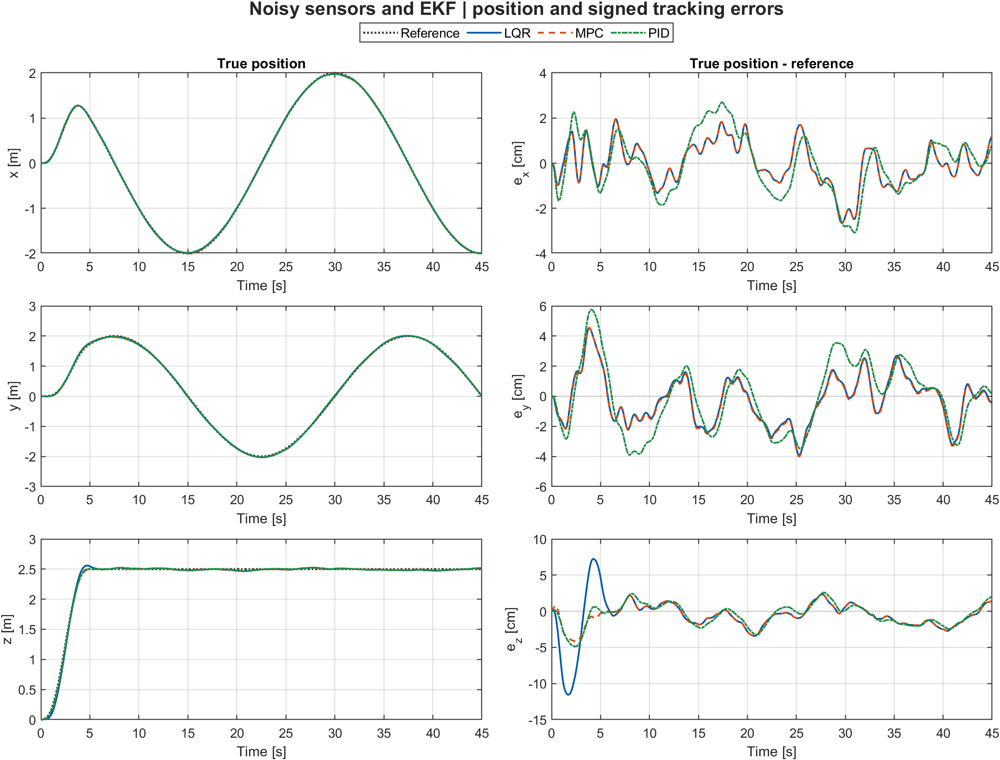
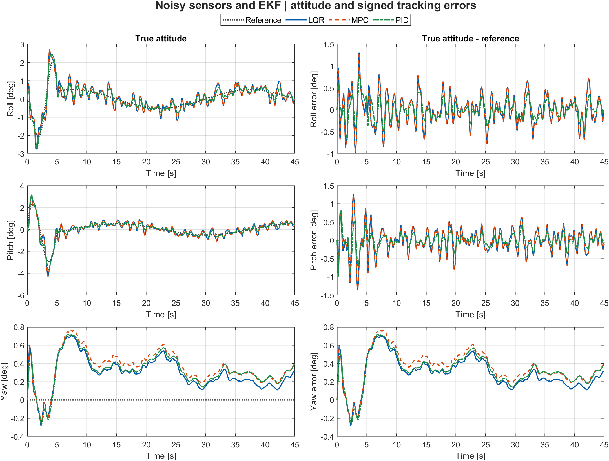
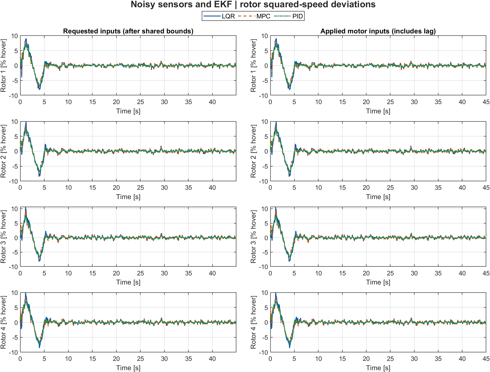
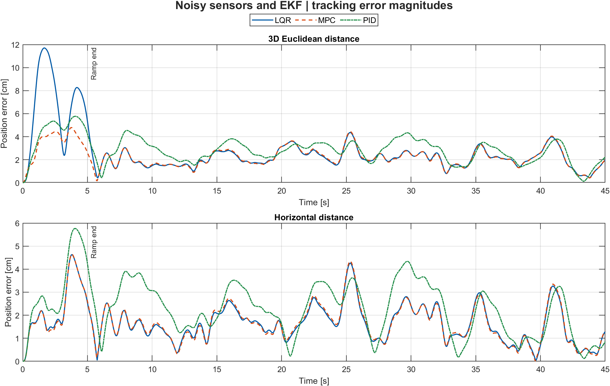
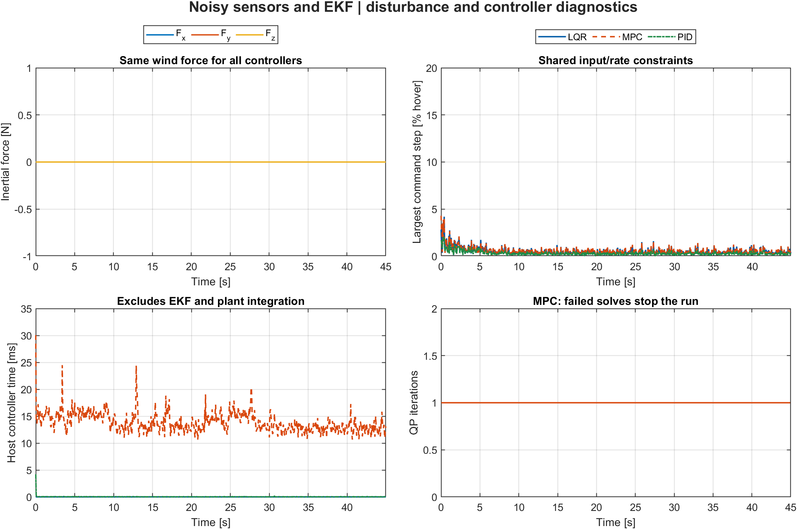
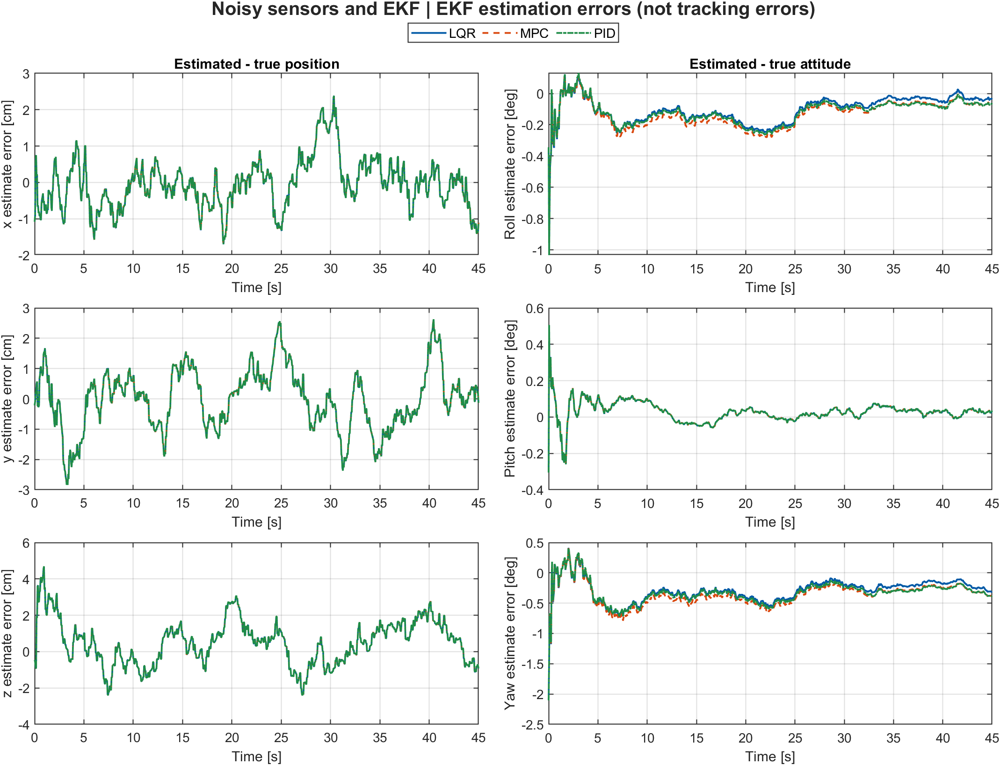
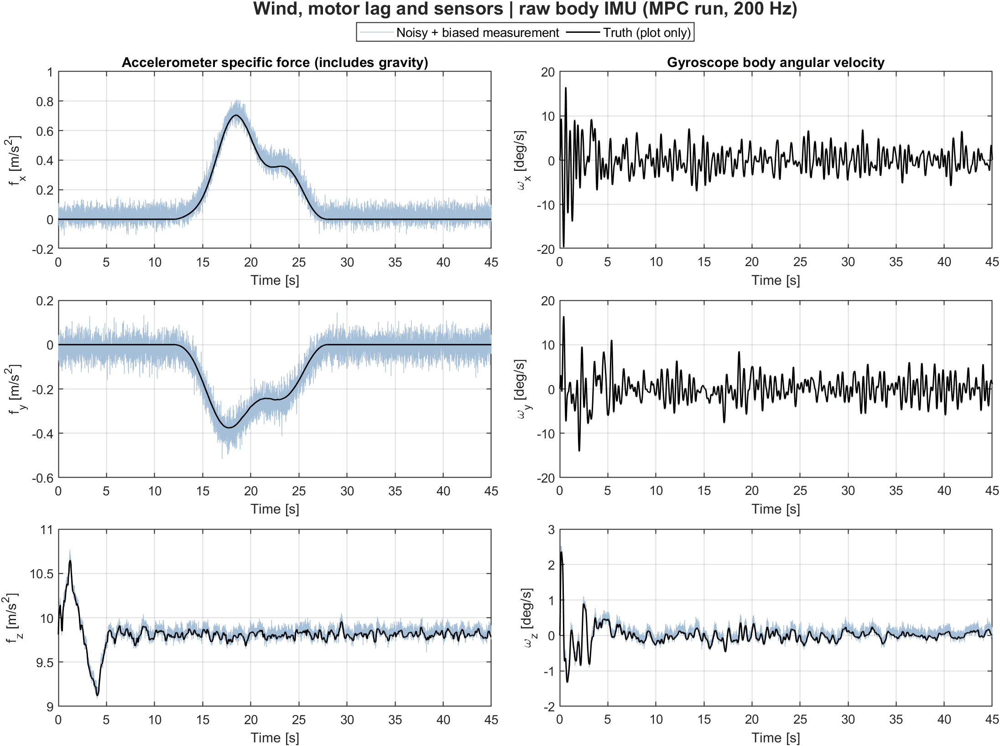

# Quadrotor: LQR, MPC, PID, and aided-IMU Kalman estimation

Three controllers track the same circular reference on a nonlinear
quadrotor plant. Compare a perfect-state baseline, noisy sensors with
an extended Kalman filter, and noisy sensors plus wind/motor lag.
The embedded firmware is unchanged.

The [equations and state-space guide](MODEL_AND_CONTROL.md) documents
the plant, motor mixer, LQR, constrained MPC, cascaded PID, sensor
measurements, and 15-state navigation EKF, including local transition
and measurement matrices.

## Run and test

Requires MATLAB, Control System Toolbox, and Model Predictive Control
Toolbox. Results were generated in MATLAB R2024b; Simulink and Sensor
Fusion Toolbox are not required.

From the repository root:

```matlab
run(fullfile('simulation', 'matlab', 'run_controller_comparison.m'))
```

The entry point clears the workspace and closes existing figures.
It runs nine 45 s simulations and exports **25 high-resolution PNGs**
in `results/ideal/`, `results/sensors/`, and `results/robustness/`.
It writes [metrics.csv](results/metrics.csv) with nine controller/scenario
rows. Full truth, estimated states, sampled IMU/aiding measurements,
biases, covariance diagonals, and controller diagnostics are retained
in the workspace's `comparisons` structure. PID runs also expose the
nine-state controller memory as `out.pidState`. For example:

```matlab
% Noisy-sensor scenario, MPC controller
out = comparisons(2).outputs{2};
plot(out.t, out.XEstimated(1,:) - out.X(1,:))
```

To run both MATLAB test files:

```matlab
results = runtests(fullfile('simulation', 'tests'));
assertSuccess(results);
```

The tests cover plant linearization and independent yaw, hover, MPC
scaling and active constraints, infeasible solver reporting, IMU frame
conventions and gravity, noise statistics and aiding sample rates, EKF
covariance/bias correction, PID hover/mixing and anti-windup, repeatable
matched noise sequences, and complete noisy and disturbed comparisons.

## Controllers and comparison fairness

- **LQR:** balanced discrete state feedback around hover.
- **MPC:** constrained linear prediction with a 2 s reference preview,
  1 s control horizon, and the same physical Q/R cost as LQR.
- **PID:** cascaded position/attitude loops, acceleration feedforward,
  bounded integrals, conditional-integration anti-windup, and standard
  plus-configuration physical thrust/torque-to-rotor mixing.

All controllers run at 20 Hz and share rotor bounds and a command step
limit of 20% of hover squared speed per sample. Plant integration and
IMU/EKF propagation run at 200 Hz. The same estimator design, sensor
configuration, seed, force, and lag are used for all controllers.
Each run owns its own filter state and independent random stream seeded
identically; it does not perturb MATLAB's global random generator.

In sensed experiments **none of the controllers receive the true plant
state**. MPC's internal estimator is disabled and its plant-state input
is the shared navigation EKF's reordered estimate. Truth is used only
to integrate the plant, synthesize sensors, and score/plot performance.
The ideal baseline explicitly bypasses the estimator.

PID does not have the same quadratic objective as LQR/MPC: it also has
acceleration feedforward and integral action. The chosen PID gains are
transparent starting points, not a claim of optimal tuning.
Neither controller prediction model explicitly includes motor lag or
wind. The IMU nevertheless measures the actual resulting acceleration,
as a physical accelerometer would.

## Sensors: representative calibrated MEMS + RTK fixed solution

Chosen in [sensorParameters.m](matlab/sensorParameters.m):

| Sensor/model | Rate | Per-sample one-sigma noise |
|--------------|------|---------------------------|
| Body accelerometer specific force | 200 Hz | 0.04 m/s^2 per axis |
| Body gyroscope angular rate | 200 Hz | 0.08 deg/s per axis |
| RTK-GNSS position | 10 Hz | 2 cm horizontal, 4 cm vertical |
| RTK-GNSS velocity | 10 Hz | 0.03 m/s horizontal, 0.05 m/s vertical |
| Three-axis magnetometer | 20 Hz | 0.35 microtesla per axis |

Residual accelerometer bias starts at `[0.020,-0.015,0.025]` m/s^2,
gyro bias at `[0.12,-0.10,0.08]` deg/s. Both drift as independent
random walks: 0.001 m/s^2/sqrt(s) and 0.005 deg/s/sqrt(s).
The local navigation-frame magnetic field is `[20,0,45]` microtesla.
The simulation seed is `20261002`.

These are **representative simulation assumptions, not measurements
from the repository's physical MPU6050 or a claimed device calibration**.
They model white sample noise, residual calibration errors, and bias
drift at the stated bandwidth. They do not include vibration, thermal
drift, clipping, magnetic interference, GNSS multipath, RTK fix loss,
correction-link outages, sensor latency, or timestamp errors.
Centimetre GNSS accuracy assumes an available, fixed RTK solution; it
is not ordinary unaided GPS performance.

An IMU alone does not make absolute position or heading observable.
GNSS position/velocity and a known magnetic field provide aiding.
The EKF propagates `[position; velocity; Euler angles; accel bias; gyro
bias]`, initializing from the first noisy fix and approximately
stationary accel/mag attitude. It does not derive a fake attitude
measurement from the true angles.

## Plant and experiments

State order is `[position; Euler angles; velocity; Euler angle rates]`.
The physical model includes nonlinear rigid-body rotation and thrust;
angles use ZYX Euler kinematics rather than treating body and Euler
rates as interchangeable. The full-rank plus-frame mixer has independent
yaw authority. Physical parameters are shared by controller and plant.
See the [model derivation](MODEL_AND_CONTROL.md).

| Setting | Value |
|---------|-------|
| Radius / period | 2 m / 30 s |
| Altitude / smooth start | 2.5 m / 5 s |
| Duration | 45 s |
| Controller / IMU / GNSS / magnetometer rate | 20 / 200 / 10 / 20 Hz |
| Initial plant state / motor input | All zeros / hover |
| Ideal baseline | Perfect state, no wind, no lag |
| Sensor case | Noisy IMU + RTK + magnetometer; EKF feedback |
| Robustness case | Same sensors/EKF + wind + 40 ms motor lag |

The force-injection envelope is
`sin(pi * clamp((t-12)/16,0,1))^2` between 12 and 28 s, multiplied by
`[0.6+0.2*sin(0.8*t); -0.4+0.15*cos(0.6*t); 0.2]` N.
This is a repeatable robustness test, not calibrated wind aerodynamics.
The 40 ms lag acts on squared rotor input.

Zero altitude is a free-flight coordinate origin, not physical ground.
Ground contact, drag, actuator identification, and communications
delays are not included.

## Verified results

3D RMS means `sqrt(mean(ex^2 + ey^2 + ez^2))` over the full run:

| Scenario | LQR RMS | MPC RMS | PID RMS |
|----------|---------|---------|---------|
| Perfect-state ideal | 1.78 cm | 0.27 cm | 0.39 cm |
| Noisy sensors + EKF | 3.31 cm | 2.45 cm | 3.07 cm |
| Sensors + wind + lag | 5.63 cm | 5.17 cm | 11.39 cm |

In the last case peak distances are **13.04 cm LQR, 13.08 cm MPC,
30.06 cm PID**. Position-estimation 3D RMS is approximately **1.79 cm**
for all three controllers; attitude-estimation RMS vector magnitude is
0.31-0.44 deg across the sensed runs. Initial transients are included.

These are one deterministic noise realization, not Monte Carlo confidence
intervals, a universal controller ranking, or verified flight accuracy.
The small ideal errors depend on perfect state feedback, accurate
parameters, a gentle reference, and feedforward/preview.

[trackingMetrics.m](matlab/trackingMetrics.m) separately reports:

- Whole-run and circle-only (`t >= 5 s`) 3D RMS, per-axis errors, and peaks.
- Coordinate-averaged RMSE (smaller than 3D RMS by `sqrt(3)`).
- Command deviation from hover: a norm in rad^2/s^2, not energy.
- Estimator position RMS and wrapped attitude RMS, scored against truth.
- Host controller timing, excluding the 200 Hz EKF and plant simulation.
  It is not a hardware real-time guarantee.

## Perfect-state baseline plots


## Noisy sensors and EKF plots











## Wind, motor lag, and noisy sensors plots




## Source entry points

- [run_controller_comparison.m](matlab/run_controller_comparison.m)
- [designLQR.m](matlab/designLQR.m), [designMPC_Linear.m](matlab/designMPC_Linear.m),
  [designPID.m](matlab/designPID.m), [pidControl.m](matlab/pidControl.m)
- [sensorParameters.m](matlab/sensorParameters.m), [sampleSensors.m](matlab/sampleSensors.m)
- [initializeNavigationFilter.m](matlab/initializeNavigationFilter.m),
  [navigationFilterStep.m](matlab/navigationFilterStep.m),
  [navigationControllerState.m](matlab/navigationControllerState.m)
- [simulateClosedLoop.m](matlab/simulateClosedLoop.m),
  [comparisonScenarios.m](matlab/comparisonScenarios.m),
  [plotComparison.m](matlab/plotComparison.m)
- [testControllers.m](tests/testControllers.m), [testSensorsAndPID.m](tests/testSensorsAndPID.m)

The separate [nonlinear MPC template](matlab/designNMPC.m) remains
experimental; the comparison uses tested **linear MPC**.
Euler representations exclude near-vertical singularities. This study
does not certify any controller gains or authorize hardware deployment.
