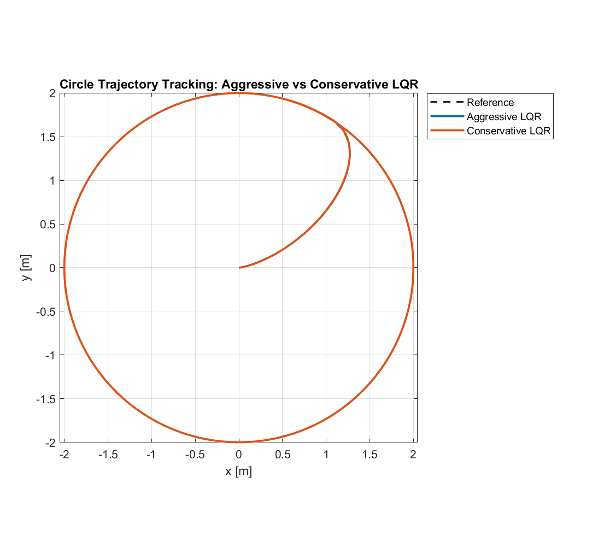
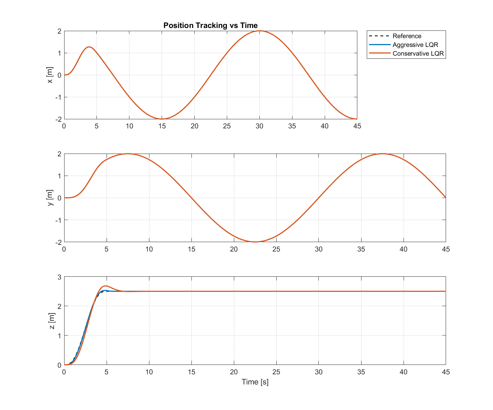
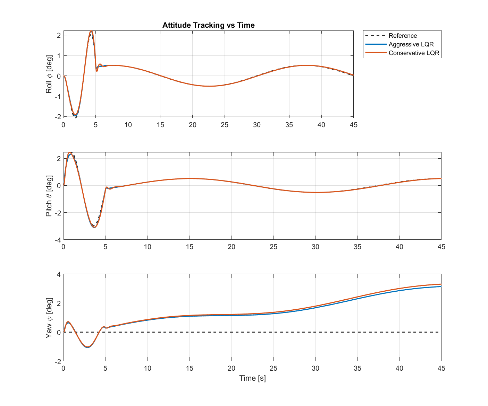
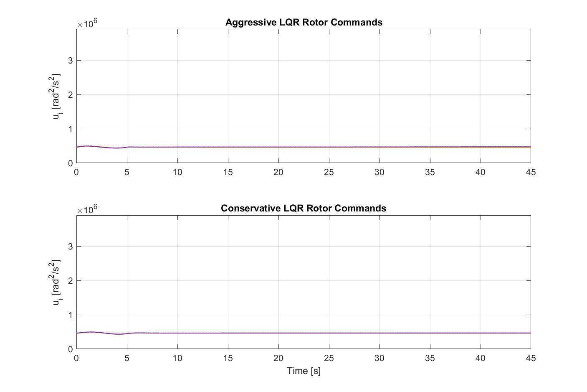
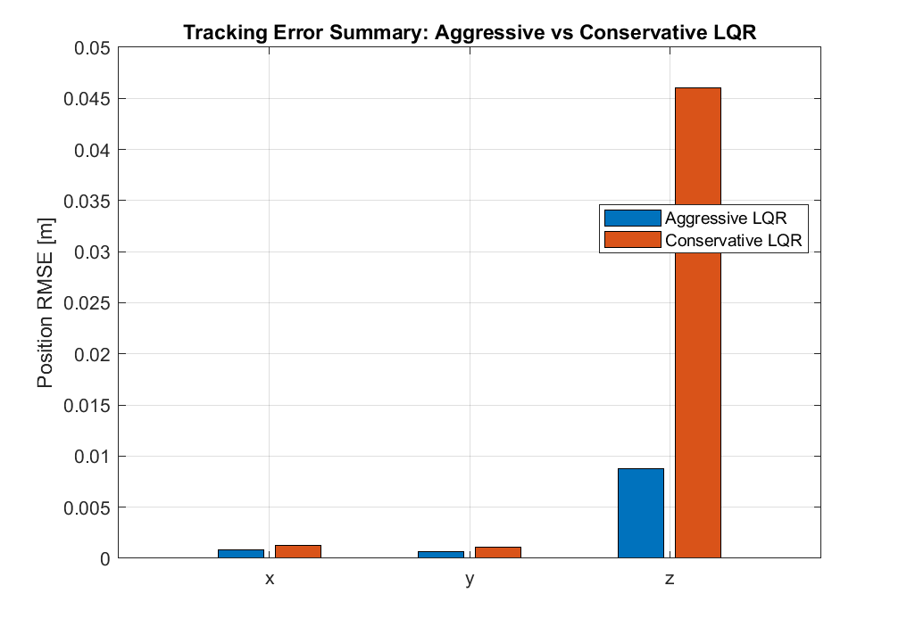

# Quadrotor controller simulation

Standalone MATLAB simulation of aggressive and conservative LQR tuning
on a nonlinear quadrotor plant. The embedded firmware is unchanged.

## Run

Requires MATLAB and Control System Toolbox (`lqr`). The default
comparison does not require Simulink or Model Predictive Control Toolbox.

From the repository root:

```matlab
run(fullfile('simulation', 'matlab', 'run_controller_comparison.m'))
```

Alternatively, open this directory in MATLAB:

```matlab
addpath('matlab')
run_controller_comparison
```

The entry point clears the workspace and closes existing figures. It
runs both controllers, prints metrics, and writes five PNG figures to
`results/`, relative to this directory regardless of the working directory.

## Layout

```text
simulation/
  README.md
  matlab/
    run_controller_comparison.m   Comparison entry point
    parameters.m                  Physical constants and rotor limits
    circleTrajectory.m            Smooth circular reference and feedforward
    quadrotorLinearModel.m        Analytical hover linearization
    designLQR.m                   Aggressive, balanced, conservative gains
    simulateClosedLoop.m          Nonlinear plant integration (RK4)
    plotComparison.m              Figures and performance metrics
    mixingMatrix.m                Thrust/torque to rotor-input mapping
    QuadrotorStateFcn.m            Nonlinear state derivatives
    QuadrotorStateJacobianFcn.m    Nonlinear model Jacobian
    designMPC_Linear.m             Experimental linear MPC template
    designNMPC.m                   Experimental nonlinear MPC template
  results/
    xy_tracking_comparison.png
    xyz_tracking_comparison.png
    attitude_comparison.png
    rotor_commands_comparison.png
    rmse_summary.png
```

The MATLAB sources and existing comparison plots were copied from the
original local simulation. Simulink caches, generated build files,
videos, and unrelated CAD/media assets are deliberately excluded.
The legacy Simulink model is also excluded: it references CAD geometry
using absolute paths to the original author's machine and is not needed
for this standalone comparison.

## Model and controller

The state vector is
`[x y z phi theta psi xdot ydot zdot phidot thetadot psidot]`.
Positions are in metres; angles are in radians. Each of the four control
inputs is squared rotor speed in rad^2/s^2.

Both LQR controllers use the same hover-linearized model for gain design
and the same nonlinear plant for simulation. Inputs are bounded by the
rotor limits in [parameters.m](matlab/parameters.m). The plant uses ten
RK4 substeps per control interval.

Default settings in
[run_controller_comparison.m](matlab/run_controller_comparison.m):

| Setting | Value |
|---------|-------|
| Circle radius | 2 m |
| Circle period | 30 s |
| Altitude | 2.5 m |
| Smooth-start ramp | 5 s |
| Simulation duration | 45 s |
| Controller sample time | 0.01 s |
| Initial state | All zeros |

Change the trajectory in the entry point and the tuning weights in
[designLQR.m](matlab/designLQR.m). Keep physical constants consistent
with the nonlinear model, which contains its own fixed coefficients.

## Comparison plots











### Metrics

The reorganized comparison was rerun in MATLAB R2024b:

| Metric | Aggressive LQR | Conservative LQR |
|--------|----------------|------------------|
| Overall position RMSE | 0.0051 m | 0.0266 m |
| X-axis RMSE | 0.0008 m | 0.0012 m |
| Y-axis RMSE | 0.0006 m | 0.0011 m |
| Z-axis RMSE | 0.0088 m | 0.0461 m |
| Mean control effort | 11,503.0 rad^2/s^2 | 6,483.1 rad^2/s^2 |

[plotComparison.m](matlab/plotComparison.m) reports:

- **Per-axis RMSE:** square root of the mean squared position error for
  each axis over the full run, including the initial ramp.
- **Overall RMSE:** square root of the mean squared error over all three
  position coordinates and all time samples. This is not the RMS
  Euclidean distance, which is larger by a factor of `sqrt(3)`.
- **Mean control effort:** mean Euclidean norm of the four rotor-command
  deviations from hover, in rad^2/s^2. This is an input-deviation metric,
  not a measurement of electrical energy or power.

## MPC status and limitations

[designMPC_Linear.m](matlab/designMPC_Linear.m) and
[designNMPC.m](matlab/designNMPC.m) are experimental templates requiring
Model Predictive Control Toolbox. They are not invoked by the default
entry point. Their closed-loop integration and solver behaviour still
need validation; the included figures compare **two LQR tunings**, not
LQR against MPC.

The default experiment assumes perfect state feedback, no wind, no
sensor noise, and no actuator delay. LQR design uses a small-angle hover
linearization. These results are not hardware validation and the gains
should not be deployed to a real airframe without further testing.
